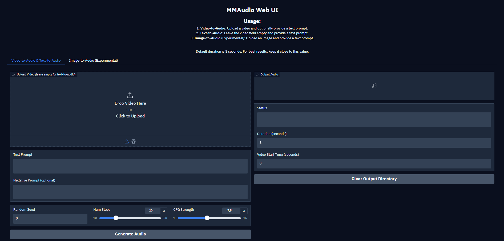

# MMAudio Web UI

A simple web user interface for MMAudio Video-to-Audio and Text-to-Audio.



## Installation

1. Clone this repository

```bash
git clone https://github.com/vpakarinen/mm-audio-webui.git

cd mm-audio-webui
```

2. Create and activate virtual environment:

```bash
python -m venv mmaudio-env

# Windows
.\mmaudio-env\Scripts\activate

# Linux/macOS
source mmaudio-env/bin/activate
```

3. Install the required packages:

```bash
pip install -r requirements.txt
```

4. Run the application:

```bash
python app.py
```

## Required Files

The application will automatically download the following files if they don't exist:
- MMAudio model weights (approximately 1.5GB)
- CLIP ViT-H-14-384 model weights
- Motion encoder weights
- BigVGAN vocoder model

## Sponsor

If you find this project useful, consider supporting me:

[](https://www.buymeacoffee.com/vpakarinen)

[](https://ko-fi.com/vpakarinen)

## Credits

This project uses the [MMAudio](https://github.com/hkchengrex/MMAudio) library for video-to-audio and text-to-audio functionality.

## Author

vpakarinen (https://github.com/vpakarinen)
